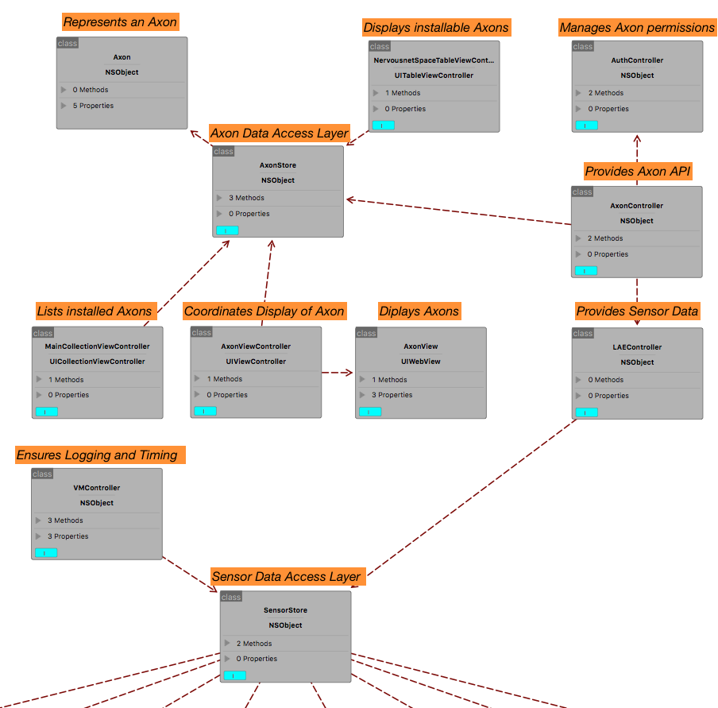

#### DRAFT - WORKING DOCUMENT - DRAFT

# nervousnet iOS
__Important__: make sure you open this project with `open nervousnet.xcworkspace` and follow the [iOS good practices](https://github.com/futurice/ios-good-practices)


### Features
_nervousnet iOS_ enables the user to locally log and share their iPhone's sensor data in many interesting ways. Logging sensor data is nothing new in itself but what makes _nervousnet iOS_ different is that the user has full control over where their data is stored.

_nervousnet iOS_ provides special "Axons" to visualise, process or share sensor data. These "Axons" can use the many functions provided by the Global and Local Analytics Engine, like machine learning algorithms. They also have access to third party libraries and if activated by the user P2P networking and internet access.`*`

"Axons" can be found and installed from within the _nervousnet iOS_ app.

`*` functionality not yet implemented.

### Architecture
In this iOS app we adhere to Apple's recommended MVC architecture and separate code into the respective `Models`, `Views`, `Controllers`, `Stores` directories. The `Assets` directory contains media, binaries and other non-swift code.

Overview:
 [](docs/nervousnet-iOS.ddsketch/QuickLook/Preview.pdf)
[Class docs](http://nervousnet.github.io/nervousnet-iOS/docs/jazzy/)


### Data Storage
The current version of the app uses [Apple's Core Data persistence framework](https://developer.apple.com/library/watchos/documentation/Cocoa/Conceptual/CoreData/index.html).

### VMController
The VMController (short for Virtual Machine Controller) will be a separate entity in the backend of the system.
It interacts and deals with the current state of the app. The state of the app is a collection of the settngs of the app as input by the user. This includes the privacy seetings,
the frequency collection for different sensors. It mantains the current state in a CoreDate file system (see Data Storage).


### Auth
Auth (short for Authentication) provides the facility to authenticate an Axon before it is allowed to use other modules of the system - e.g. LAE. This authentication is performed by the Axon Controller which forms the central module that all other modules interacts with (see Axon Provider).
    Before any application is granted read-access to any sensor Data, the method checkApp is called. This method takes a unique identifier token, the name of the requesting app, as well as booleans for the requested access as arguments. It then either prompts the user to grant access and creates a new entry for the app in core data, or, if there is a previous entry, grants permissions based on the values stored in core data, which can be changed through the app-settings. In case the token is a mismatch, permission will be denied and the user will be notified of the failed access attempt.


### LAE
The LAE (short for Local Analytics Engine) is an engine that interfaces the VM with any other application in the system architecture.
   The LAE provides a high level abstraction of the physical sensors in the database.
   It also allows all the application to fetch and receive the data from the database (with multiple criteria as given by the user).
   It also has the capability to not only give out sensor data in the raw format but also provide analytics on it. For example, the LAE will allow an application to fetch
   mean or standard deviation on the the data. It can be designed to provide even more capabilities like clustering etc.


### Axons
"Axons" are written in JavaScript and HTML. They follow strict view and code separation and must be contained within a single directory. Important external dependencies like jQuery and the Nervous JS API are provided by the nervousnet iOS app. All other libraries must be included by the developer.

The minimal Axon must provide the following three files zipped within a folder baring the same name as the app in kebab-case:
```
my-first-axon/
   package.json
   axon.js
   axon.html
```
An example app can be forked [here](https://github.com/bitmorse/axon-one). More details on making and submitting Axons and what features they can access [here](https://github.com/nervousnet/nervousnet-axons/blob/master/README.md).

Axons must be installed from within the _nervousnet iOS_ app in a location named _nervousnet space_. This is done automatically by downloading the ZIP of the master branch and unzipping it to the app's home directory. When a user selects to run an Axon, the app opens a modal window containing a WebView displaying the `axon.html`. All Axon resources are served by a local lightweight HTTP server called __Axon Controller__ (the WebKit engine does not allow file:/// XMLHTTPRequests).

Axons specify requested privileges in `package.json`. On first Axon execution, the user will be prompted to grant or deny access. Once granted, the Axon can access all authorised methods.


### Axon Controller
The Axon Controller is the __HTTP server__ running locally on the phone that serves Axon assets to the webview as well as handles requests sent via the Nervous JS API. With every JS API method call, the Axon must send an authentication token known only to the Axon and the Auth. This token effectively authenticates the Axon to the Local Analytics Engine and thus authorises the Axon to access sensor data that it has been given access to (by the user prompt). [Methods are documented here](https://github.com/nervousnet/nervousnet-axons/blob/master/README.md).


## Community

[](https://nervousnet.slack.com)

Join us on [Slack](https://nervousnet.slack.com).

License
-------

**nervousnet iOS** is released under the GPL. See LICENSE for details.
